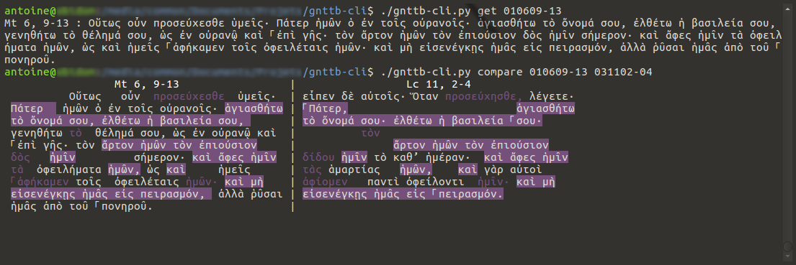

# gnttb-cli
Command line interface for the Greek New Testament toolbox.

## Installation

1. Install the Greek New Testament toolbox ([gnttb](https://github.com/a2ohm/gnttb)).
2. Clone the [gnttb-cli](https://github.com/a2ohm/gnttb-cli) repository.

## Help

General help.

    ./gnttb-cli.py --help

Help on a given sub-command (here, the search sub-command).

    ./gnttb-cli.py search --help

### Search

    ./gnttb-cli.py search θάλασσα --> search θάλασσα in all the NT
    id is 01).

    ./gnttb-cli.py search -b gospels θάλασσα --> search θάλασσα in the
    four gospels
    
    ./gnttb-cli.py search -b gospels -b 27 θάλασσα --> search θάλασσα in
    the four gospels and in the book of Revelation (whose id is 27)

    ./gnttb-cli.py search -b 01 --ccatParse "****N***" θάλασσα -->
    search θάλασσα at the nominative case in the book of Matthiew 

### About bcv

bcv stands for "book, chapter, verse". It is a convenient way to refer
to a verse, or a group of verses, in the New Testament.

A bcv is a six-digit number. The first two designate the book (following
the canonical order from 01 to 27), the next two the chapter, the last
two the verse.

Examples:

* 011701 --> Mt 17, 1
* 090220 --> Ga 2, 20

A group of verses is designated by an interval of bcv.

Examples:

* 010609-13 --> Mt 6, 9-13
* 041501-1604 --> Jn 15, 1 − 16, 04
